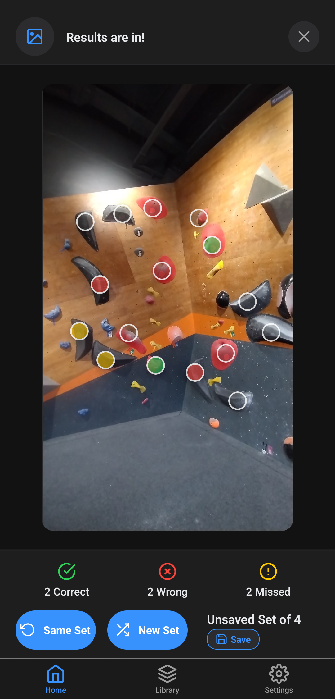
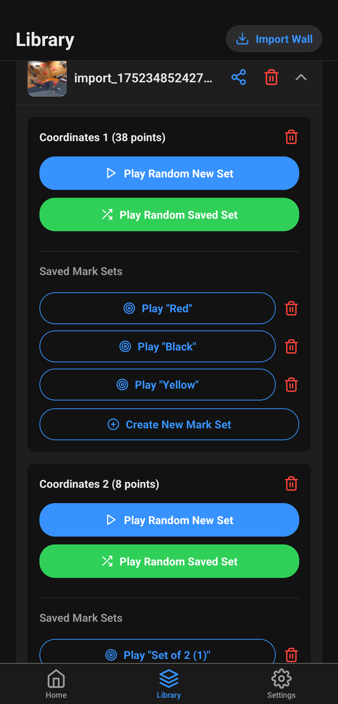
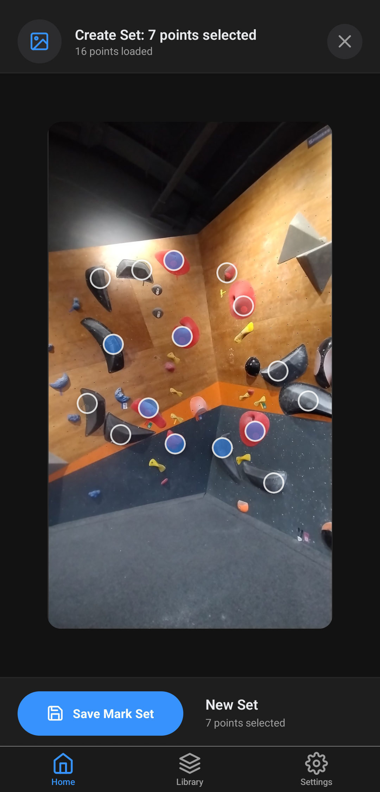
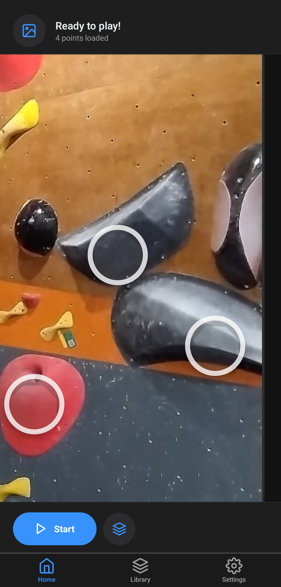

# Memorize that wall

An app to help you with the memorization of new climbing routes and bouldering problems:
- Spray walls sequences
- Custom routes

1. Import a **photo**
2. Tap on holds
3. Get a **randomized** set of **holds**
4. **Memorize** and test your skills!
5. *Share* your Walls with others!

## Practise to memorize new routes

Get an *Instant feedback* on your memorization

  
  

## Simpler problems

Create *simpler* walls with *fewer* total marks

## Random or custom

Let the program create *randomized problems* for you or *create your own*!

## Zoom in

Zoom in to see tiny holds

